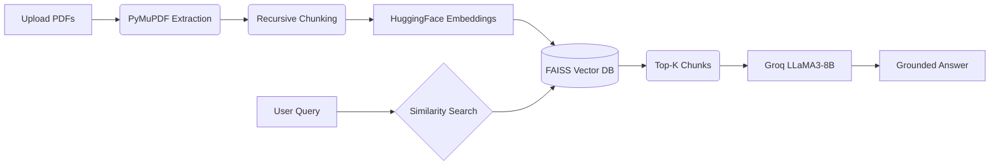

# 🧠 ResearchOS - Personal Research Assistant

A powerful, blazingly fast **Retrieval-Augmented Generation (RAG)** system built to transform static PDF documents into an interactive, conversational knowledge base. Powered by **Meta LLaMA-3.1-8B** (via Groq) for instant intelligence and grounded on **FAISS** semantic similarity search.


---

## ✨ Features

| Feature | Description |
|---------|-------------|
| **📄 PDF Ingestion** | Upload multiple research papers or documents simultaneously via PyMuPDF. |
| **🔍 Semantic Search** | FAISS-powered vector similarity search using HuggingFace `all-MiniLM-L6-v2`. |
| **🤖 Grounded Answers** | Strict system prompts ensure the LLM only answers what it explicitly knows. |
| **🔬 Evidence Inspector** | A transparent UI panel showing exactly which chunks informed the response. |
| **🔒 Authentication** | Front-door security requiring a customizable passkey to access the hub. |
| **💾 Export & Manage** | Export your chat sessions to `.md` files or clear the database instantly. |
| **⚡ Blazing Fast Generation** | Sub-second token delivery powered by Groq's LPU inference engine. |

---

## 🏗️ Architecture Stack

*   **Frontend UI:** Streamlit
*   **Orchestration:** LangChain (0.3.x)
*   **Vector Database:** FAISS (CPU-Optimized)
*   **Document Embeddings:** HuggingFace `all-MiniLM-L6-v2`
*   **Large Language Model:** Groq (`llama-3.1-8b-instant`)



---

## 🚀 Quick Start (Local Development)

### Prerequisites
- Python 3.10+
- A [Groq API Key](https://console.groq.com/keys)

### 1. Installation

```bash
# Clone the repository
git clone https://github.com/YOUR_USERNAME/research-os.git
cd research-os

# Create a virtual environment (optional but recommended)
python -m venv venv
source venv/bin/activate  # On Windows use: venv\Scripts\activate

# Install exact dependencies
pip install -r requirements.txt
```

### 2. Configuration Setup

Streamlit uses a specific directory for sensitive keys. Create a `.streamlit/secrets.toml` file in the root directory:

```toml
[secrets]
# Your Groq API key for the LLM
GROQ_API_KEY = "gsk_your_key_here"

# The master password to access your Streamlit app
APP_PASSWORD = "your-secure-password"
```

> ⚠️ **Never commit your `.streamlit/secrets.toml` file to GitHub!** It is already included in the `.gitignore`.

### 3. Run Locally

```bash
streamlit run app.py
```

Open `http://localhost:8501` in your browser.
**Default Passkey:** `research_secure_123`

---

## ☁️ Deploy to Streamlit Community Cloud

This project is perfectly optimized for immediate deployment on Streamlit Cloud.

1. **Push your code to GitHub** (Ensure `secrets.toml` is NOT committed).
2. Go to [share.streamlit.io](https://share.streamlit.io).
3. Click **New App** → Select your repository → Choose `app.py` as the entrypoint.
4. **CRITICAL STEP:** Before deploying, go to **Advanced Settings** → **Secrets** and paste in your configuration exactly as it looks locally:
    ```toml
    [secrets]
    GROQ_API_KEY = "gsk_your_key_here"
    APP_PASSWORD = "your-secure-password"
    ```
5. Click **Deploy!** 🎉

---

## 📁 Project Structure

```text
research-os/
├── .gitignore              # Git ignore rules (protects secrets)
├── .streamlit/
│   └── secrets.toml        # Local API keys (DO NOT COMMIT)
├── app.py                  # Main Streamlit UI, Layout, & Auth logic
├── utils.py                # Backend Pipeline (LangChain, Groq, FAISS)
├── requirements.txt        # Frozen Python dependencies
└── README.md               # You are here
```

---

## 📝 Usage Guide

1. **Authenticate** on the splash screen using your `APP_PASSWORD`.
2. Open the **Sidebar Document Hub** and upload one or more PDFs.
3. Click **⚡ Process DB** to extract, chunk, and embed the knowledge base.
4. Use the **Chat Interface** to ask questions grounded strictly in the files.
5. Review the **Evidence Inspector** side-panel to see the exact text chunks the LLM cited.
6. Use the **Session Controls** to Export your chat or Clear the history/database.

---

## 🤝 Contributing
Contributions, issues, and feature requests are welcome!

## 👨‍💻 Author

<table>
<tr>
<td align="center">
<strong>Arya Yadav</strong><br>
Bennett University<br>
<a href="mailto:aryayadav5012@gmail.com">📧 Email</a> |
<a href="https://github.com/ARYA-5012">🐙 GitHub</a>
</td>
</tr>
</table>

---

## 📄 License
This project is licensed under the MIT License.
